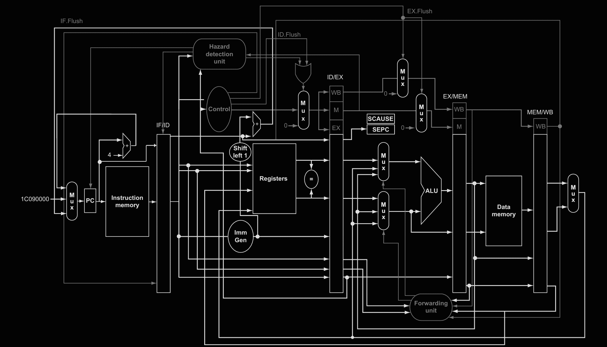

# RISC-V_CPU_RTL

```markdown
# 🚀 Educational RV32I Processor Core

An educational, step-by-step implementation of a 32-bit RISC-V processor core written in SystemVerilog. This project guides students and computer architecture enthusiasts through the progressive stages of CPU design—from a simple single-cycle execution engine up to a full 5-stage pipelined core featuring CSR support and instruction/data caches.



> **⚠️ Educational Disclaimer & Notice:**  
> This is a hands-on, personal educational project created while learning computer architecture. While the core successfully executes the provided Assembly and C benchmarks, it may contain subtle bugs or edge-case limitations when exposed to non-standard code or unhandled hazard conditions. Feedback, issues, and contributions are greatly appreciated!

---

## 🏛️ Architecture Highlights

- **Instruction Set Architecture:** Full RV32I Base Integer ISA + `Zicsr` Extension.
- **Pipeline Structure:** 5-Stage Pipeline (`IF` → `ID` → `EX` → `MEM` → `WB`) equipped with full **Data Forwarding** and **Hazard Detection** units.
- **Memory Subsystem & Caches:**
  - **Instruction Cache (I-Cache):** Direct-mapped cache for low-latency instruction fetching.
  - **Data Cache (D-Cache):** 2-Way Set Associative Cache utilizing a **Write-Back** policy with a **16-byte block size**.
- **Exception & Trap Control:** CSR registers (`cs_registers.sv`) with trap vector handling (`trap_controller.sv`).
- **Simulation Environment:** Automated C++ testbenches integrated via **Verilator**.

---

## 📂 Repository Structure

```text
.
├── src/                # Latest top-level implementation (RV32I + Zicsr + Cache)
│   ├── includes/       # SystemVerilog package definitions (rv32_types_pkg.sv)
│   └── rtl/            # RTL source code files
├── versions/           # Progressive building stages for step-by-step learning
│   ├── simpe_single_cycle/
│   ├── full_single-cycle/
│   ├── pipeline_no_hazards/
│   ├── complete_pipeline/
│   ├── rv32i_zicsr/
│   ├── rv32i_zicsr_cache/
│   └── cache/          # Standalone Cache modules (Direct-mapped & 2-Way)
├── tests/              # Assembly, C programs, Linker scripts, and HEX binaries
├── testbench/          # Verilator C++ testbenches
├── sim/                # Generated simulation logs and GTKWave VCD traces
└── docs/               # Datasheets, green cards, and architecture diagrams

```

---

## 🗺️ Progressive Learning Path (`versions/`)

To understand the core design evolution, follow the implementation progression inside the `versions/` folder:

1. **`simpe_single_cycle`**: Minimal single-cycle implementation for core arithmetic and logical instructions.
2. **`full_single-cycle`**: Complete single-cycle execution of all RV32I instructions.
3. **`pipeline_no_hazards`**: Basic 5-stage pipeline without hazard control (requires NOP insertion).
4. **`complete_pipeline`**: Pipelined core with dedicated **Forwarding Unit** and **Hazard Detection Unit**.
5. **`rv32i_zicsr`**: Integrated Control and Status Registers (`Zicsr`) and hardware trap handling.
6. **`rv32i_zicsr_cache`**: Complete CPU core with I-Cache and D-Cache integration.

---

## 🛠️️ Prerequisites & Setup

Ensure you have the following tools installed on your development environment:

1. **Verilator** (ver 4.x+):
```bash
sudo apt install verilator

```


2. **RISC-V GCC Cross-Compiler (`riscv32-unknown-elf-gcc`)**:
*Build from the official [riscv-gnu-toolchain](https://github.com/riscv-collab/riscv-gnu-toolchain) repository if unavailable in your package manager.*
3. **GTKWave** *(Optional, for inspecting `.vcd` waveforms)*:
```bash
sudo apt install gtkwave

```


---

## 💻 Simulation & Execution Guide

### Option 1: Main Core Simulation (Root Directory)

Run default simulation from the main repository directory:

```bash
make run

```

Specify a custom binary or testbench:

```bash
make run TEST=tests/hex/bubble-sort.hex TB=testbench/top_tb.cpp

```

### Option 2: Individual Stage Testing (`versions/`)

Navigate directly to any educational version and execute using `make`:

```bash
cd versions/complete_pipeline
make

```

Pass custom compiled programs directly to specific stages:

```bash
make TEST=program.hex

```

---

## 🧪 Compiling Custom Software Benchmarks

Compile your own C or Assembly routines into memory-loadable `.hex` files:

* **Assembly Programs (`.S`):**
```bash
cd tests/asm_programs
make

```


* **C Benchmark Programs (`.c`):**
```bash
cd tests/c_programs
make

```


*Output `.hex` files are stored in `tests/hex/` ready to be loaded by the processor memory model.*

---

## 📜 License

Distributed under the MIT License. See `LICENSE` for more information.

```
